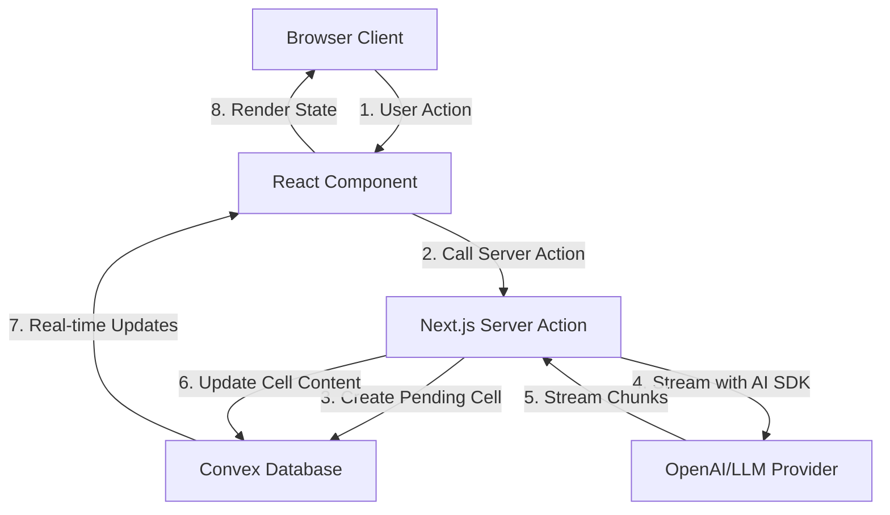

# AI SDK Integration Architecture

## Overview

This document outlines the integration architecture for Vercel AI SDK 5 Alpha with Forgepad.ai, using Next.js Server Actions for AI operations and Convex as the single source of truth for all application state.

## Core Principles

1. **Single Source of Truth**: Convex database stores all application state, including streaming progress
2. **Server Actions Only**: No API routes - all AI operations use Next.js Server Actions
3. **No Reverse Calls**: Convex never calls Next.js endpoints
4. **State-Driven UI**: React components subscribe to Convex and update automatically
5. **Error Resilience**: All errors are represented as database state

## Architecture Flow



## Data Model

### Cells Table
```typescript
{
  _id: Id<"cells">,
  workspaceId: Id<"workspaces">,
  stackPosition: number,
  content: string,
  status: "pending" | "streaming" | "complete" | "error" | "cancelled",
  error?: string,
  metadata: {
    prompt?: string,
    model?: string,
    temperature?: number,
    maxTokens?: number,
    startedAt?: number,
    completedAt?: number,
    tokenCount?: number,
    streamedChunks?: number,
  },
  createdAt: number,
  updatedAt: number,
}
```

### Workspaces Table
```typescript
{
  _id: Id<"workspaces">,
  name: string,
  description?: string,
  stack: Id<"cells">[],  // Ordered array of cell IDs
  namedCells: Record<string, Id<"cells">>,  // Named references
  settings: {
    defaultModel?: string,
    temperature?: number,
    maxTokens?: number,
  },
  createdAt: number,
  updatedAt: number,
}
```

### Operations Table (Audit Trail)
```typescript
{
  _id: Id<"operations">,
  workspaceId: Id<"workspaces">,
  type: "query" | "expand" | "filter" | "merge" | "summarize" | "fork",
  inputCells: Id<"cells">[],
  outputCell: Id<"cells">,
  parameters: Record<string, any>,
  duration: number,
  createdAt: number,
}
```

## Server Actions Implementation

### Core AI Generation Action
```typescript
// app/actions/ai.ts
'use server'

import { ConvexHttpClient } from "convex/browser";
import { api } from "@/convex/_generated/api";
import { streamText, generateObject, streamObject } from "ai";
import { openai } from "@ai-sdk/openai";
import { z } from "zod";

const convex = new ConvexHttpClient(process.env.CONVEX_URL!);

export async function generateWithAI({
  prompt,
  workspaceId,
  stackPosition,
  model = "gpt-4",
  temperature = 0.7,
  maxTokens = 2000,
}: {
  prompt: string;
  workspaceId: string;
  stackPosition: number;
  model?: string;
  temperature?: number;
  maxTokens?: number;
}) {
  // Create cell in pending state
  const cellId = await convex.mutation(api.cells.create, {
    workspaceId,
    stackPosition,
    content: "",
    status: "pending",
    metadata: {
      prompt,
      model,
      temperature,
      maxTokens,
      startedAt: Date.now(),
    },
  });

  try {
    // Update to streaming state
    await convex.mutation(api.cells.updateStatus, {
      cellId,
      status: "streaming",
    });

    // Start streaming with AI SDK
    const result = streamText({
      model: openai(model),
      prompt,
      temperature,
      maxTokens,
    });

    // Process stream with intelligent batching
    let accumulated = "";
    let lastUpdate = Date.now();
    let chunkCount = 0;
    const UPDATE_INTERVAL = 500; // ms
    const UPDATE_THRESHOLD = 100; // characters

    for await (const chunk of result.textStream) {
      accumulated += chunk;
      chunkCount++;

      const shouldUpdate =
        accumulated.length >= UPDATE_THRESHOLD ||
        Date.now() - lastUpdate >= UPDATE_INTERVAL ||
        chunk.includes("\n\n"); // Update on paragraph breaks

      if (shouldUpdate) {
        await convex.mutation(api.cells.updateContent, {
          cellId,
          content: accumulated,
          streamedChunks: chunkCount,
        });
        lastUpdate = Date.now();
      }
    }

    // Final update with complete content
    const usage = await result.usage;
    await convex.mutation(api.cells.finalize, {
      cellId,
      content: accumulated,
      status: "complete",
      metadata: {
        completedAt: Date.now(),
        tokenCount: usage?.totalTokens,
        streamedChunks: chunkCount,
      },
    });

    return { cellId, success: true };
  } catch (error) {
    // Error state in database
    await convex.mutation(api.cells.setError, {
      cellId,
      error: error instanceof Error ? error.message : "Unknown error",
      status: "error",
    });

    return { cellId, success: false, error };
  }
}
```

### Stack Operations
```typescript
// app/actions/stack-operations.ts
'use server'

export async function performStackOperation({
  workspaceId,
  operation,
  parameters,
}: {
  workspaceId: string;
  operation: "query" | "expand" | "filter" | "merge" | "summarize";
  parameters: Record<string, any>;
}) {
  const workspace = await convex.query(api.workspaces.get, { id: workspaceId });
  
  switch (operation) {
    case "query": {
      const topCell = await convex.query(api.cells.get, { 
        id: workspace.stack[workspace.stack.length - 1] 
      });
      
      const prompt = `${parameters.query}\n\nContext:\n${topCell.content}`;
      return generateWithAI({
        prompt,
        workspaceId,
        stackPosition: workspace.stack.length,
      });
    }
    
    case "expand": {
      // Implementation for expand operation
      break;
    }
    
    // ... other operations
  }
}
```

### Structured Output Generation
```typescript
export async function generateStructuredData({
  prompt,
  schema,
  workspaceId,
}: {
  prompt: string;
  schema: z.ZodSchema;
  workspaceId: string;
}) {
  const cellId = await convex.mutation(api.cells.create, {
    workspaceId,
    stackPosition: -1, // Special position for structured data
    content: "",
    status: "pending",
    metadata: { type: "structured" },
  });

  try {
    const result = await generateObject({
      model: openai("gpt-4"),
      prompt,
      schema,
    });

    await convex.mutation(api.cells.finalizeStructured, {
      cellId,
      content: JSON.stringify(result.object, null, 2),
      structuredData: result.object,
      status: "complete",
    });

    return { cellId, data: result.object };
  } catch (error) {
    await convex.mutation(api.cells.setError, {
      cellId,
      error: error.message,
      status: "error",
    });
    throw error;
  }
}
```

## Client Components

### Streaming Cell Component
```typescript
// components/cells/StreamingCell.tsx
'use client'

import { useQuery } from "convex/react";
import { api } from "@/convex/_generated/api";
import { Card } from "@/components/ui/card";
import { Loader2, AlertCircle, CheckCircle } from "lucide-react";
import ReactMarkdown from "react-markdown";
import { cn } from "@/lib/utils";

export function StreamingCell({ cellId }: { cellId: Id<"cells"> }) {
  const cell = useQuery(api.cells.get, { id: cellId });

  if (!cell) return null;

  return (
    <Card className={cn(
      "transition-all duration-200",
      cell.status === "streaming" && "border-primary/50 shadow-lg",
      cell.status === "error" && "border-destructive"
    )}>
      <div className="p-6">
        {/* Status Indicator */}
        <div className="flex items-center justify-between mb-4">
          <div className="flex items-center gap-2 text-sm text-muted-foreground">
            {cell.status === "pending" && (
              <>
                <Loader2 className="h-4 w-4 animate-spin" />
                <span>Preparing...</span>
              </>
            )}
            {cell.status === "streaming" && (
              <>
                <Loader2 className="h-4 w-4 animate-spin" />
                <span>Generating... ({cell.metadata?.streamedChunks || 0} chunks)</span>
              </>
            )}
            {cell.status === "complete" && (
              <>
                <CheckCircle className="h-4 w-4 text-green-500" />
                <span>Complete ({cell.metadata?.tokenCount || 0} tokens)</span>
              </>
            )}
            {cell.status === "error" && (
              <>
                <AlertCircle className="h-4 w-4 text-destructive" />
                <span>Error</span>
              </>
            )}
          </div>
          
          {cell.metadata?.model && (
            <span className="text-xs bg-muted px-2 py-1 rounded">
              {cell.metadata.model}
            </span>
          )}
        </div>

        {/* Content */}
        <div className="prose prose-sm dark:prose-invert max-w-none">
          <ReactMarkdown>{cell.content}</ReactMarkdown>
          
          {/* Streaming cursor */}
          {cell.status === "streaming" && (
            <span className="inline-block w-2 h-4 bg-foreground/50 animate-pulse ml-1" />
          )}
        </div>

        {/* Error Display */}
        {cell.status === "error" && (
          <div className="mt-4 p-4 bg-destructive/10 rounded-md">
            <p className="text-sm text-destructive">{cell.error}</p>
          </div>
        )}

        {/* Metadata Footer */}
        {cell.status === "complete" && cell.metadata?.completedAt && (
          <div className="mt-4 pt-4 border-t text-xs text-muted-foreground">
            Generated in {Math.round((cell.metadata.completedAt - cell.metadata.startedAt!) / 1000)}s
          </div>
        )}
      </div>
    </Card>
  );
}
```

### Workspace Stack View
```typescript
// components/workspace/WorkspaceStack.tsx
'use client'

import { useQuery, useMutation } from "convex/react";
import { api } from "@/convex/_generated/api";
import { generateWithAI } from "@/app/actions/ai";
import { Button } from "@/components/ui/button";
import { Textarea } from "@/components/ui/textarea";
import { StreamingCell } from "@/components/cells/StreamingCell";
import { useState } from "react";

export function WorkspaceStack({ workspaceId }: { workspaceId: string }) {
  const workspace = useQuery(api.workspaces.get, { id: workspaceId });
  const [prompt, setPrompt] = useState("");
  const [isGenerating, setIsGenerating] = useState(false);

  const handleGenerate = async () => {
    if (!prompt.trim() || !workspace) return;

    setIsGenerating(true);
    try {
      await generateWithAI({
        prompt,
        workspaceId,
        stackPosition: workspace.stack.length,
      });
      setPrompt("");
    } finally {
      setIsGenerating(false);
    }
  };

  if (!workspace) return <div>Loading...</div>;

  return (
    <div className="space-y-4">
      {/* Stack Display */}
      <div className="space-y-4">
        {workspace.stack.map((cellId, index) => (
          <div key={cellId} className="relative">
            <div className="absolute -left-12 top-6 text-sm text-muted-foreground">
              {workspace.stack.length - index}
            </div>
            <StreamingCell cellId={cellId} />
          </div>
        ))}
      </div>

      {/* Input Area */}
      <div className="sticky bottom-0 bg-background/95 backdrop-blur p-4 border-t">
        <div className="space-y-2">
          <Textarea
            value={prompt}
            onChange={(e) => setPrompt(e.target.value)}
            placeholder="Enter a prompt..."
            className="min-h-[100px]"
            onKeyDown={(e) => {
              if (e.key === "Enter" && e.metaKey) {
                handleGenerate();
              }
            }}
          />
          <div className="flex justify-between items-center">
            <span className="text-xs text-muted-foreground">
              Press ⌘+Enter to generate
            </span>
            <Button 
              onClick={handleGenerate} 
              disabled={!prompt.trim() || isGenerating}
            >
              {isGenerating ? "Generating..." : "Generate"}
            </Button>
          </div>
        </div>
      </div>
    </div>
  );
}
```

## Update Batching Strategy

To minimize database writes while maintaining responsive UI:

1. **Time-based batching**: Update every 500ms
2. **Size-based batching**: Update every 100 characters
3. **Semantic batching**: Update on paragraph/section breaks
4. **Priority batching**: Immediate update for first chunk, then batch

```typescript
class UpdateBatcher {
  private buffer = "";
  private lastUpdate = Date.now();
  private updateTimer: NodeJS.Timeout | null = null;

  constructor(
    private updateFn: (content: string) => Promise<void>,
    private options = {
      timeThreshold: 500,
      sizeThreshold: 100,
      semanticBreaks: ["\n\n", "```", "###", "---"],
    }
  ) {}

  async addChunk(chunk: string): Promise<void> {
    this.buffer += chunk;

    const shouldUpdate =
      this.buffer.length >= this.options.sizeThreshold ||
      Date.now() - this.lastUpdate >= this.options.timeThreshold ||
      this.options.semanticBreaks.some((break) => chunk.includes(break));

    if (shouldUpdate) {
      await this.flush();
    } else {
      this.scheduleUpdate();
    }
  }

  private scheduleUpdate(): void {
    if (this.updateTimer) return;

    this.updateTimer = setTimeout(() => {
      this.flush();
    }, this.options.timeThreshold);
  }

  async flush(): Promise<void> {
    if (!this.buffer) return;

    if (this.updateTimer) {
      clearTimeout(this.updateTimer);
      this.updateTimer = null;
    }

    await this.updateFn(this.buffer);
    this.buffer = "";
    this.lastUpdate = Date.now();
  }
}
```

## Error Handling & Recovery

### Retry Logic
```typescript
export async function generateWithRetry(params: GenerateParams, maxRetries = 3) {
  for (let attempt = 0; attempt < maxRetries; attempt++) {
    try {
      return await generateWithAI(params);
    } catch (error) {
      if (attempt === maxRetries - 1) throw error;
      
      // Exponential backoff
      await new Promise(resolve => setTimeout(resolve, Math.pow(2, attempt) * 1000));
    }
  }
}
```

### Resume Capability
```typescript
export async function resumeGeneration(cellId: string) {
  const cell = await convex.query(api.cells.get, { id: cellId });
  
  if (cell.status !== "error" || !cell.metadata?.prompt) {
    throw new Error("Cannot resume this cell");
  }

  return generateWithAI({
    prompt: cell.metadata.prompt,
    workspaceId: cell.workspaceId,
    stackPosition: cell.stackPosition,
    // Resume with same parameters
    model: cell.metadata.model,
    temperature: cell.metadata.temperature,
  });
}
```

## Performance Considerations

1. **Database Write Optimization**
   - Batch updates to reduce write frequency
   - Use semantic boundaries for natural update points
   - Implement exponential backoff for retries

2. **Client Performance**
   - Virtualize long stacks (only render visible cells)
   - Lazy load cell content for large documents
   - Debounce rapid user inputs

3. **Streaming Optimization**
   - First chunk updates immediately for perceived performance
   - Subsequent chunks batch based on size/time
   - Final update ensures complete content is saved

## Security Considerations

1. **API Key Management**
   - Store OpenAI API key in environment variables
   - Never expose keys to client
   - Implement rate limiting per user

2. **Input Validation**
   - Sanitize prompts before sending to LLM
   - Implement prompt injection detection
   - Limit prompt length

3. **Access Control**
   - Verify workspace ownership in server actions
   - Implement Clerk authentication checks
   - Audit trail for all operations

## Migration Path

### Phase 1: Basic Implementation
- [ ] Set up server actions for text generation
- [ ] Implement basic cell creation and updates
- [ ] Create streaming cell component
- [ ] Test with simple prompts

### Phase 2: Stack Operations
- [ ] Implement query, expand, filter operations
- [ ] Add operation chaining
- [ ] Create operation history

### Phase 3: Advanced Features
- [ ] Structured output generation
- [ ] Multi-modal support (images)
- [ ] Custom model selection
- [ ] Temperature and parameter controls

### Phase 4: Optimization
- [ ] Implement update batching
- [ ] Add retry logic
- [ ] Performance monitoring
- [ ] Error recovery flows

## Testing Strategy

1. **Unit Tests**
   - Server action logic
   - Update batching algorithm
   - Error handling

2. **Integration Tests**
   - Full streaming flow
   - Database state transitions
   - Error recovery

3. **E2E Tests**
   - User workflows
   - Stack operations
   - Real-time updates

## Monitoring & Observability

1. **Metrics to Track**
   - Streaming latency
   - Update frequency
   - Error rates
   - Token usage

2. **Logging**
   - Server action invocations
   - Streaming progress
   - Error details
   - Performance metrics

## Next Steps

1. Review and approve this architecture
2. Set up development environment
3. Implement Phase 1 basic features
4. Test with real workflows
5. Iterate based on feedback